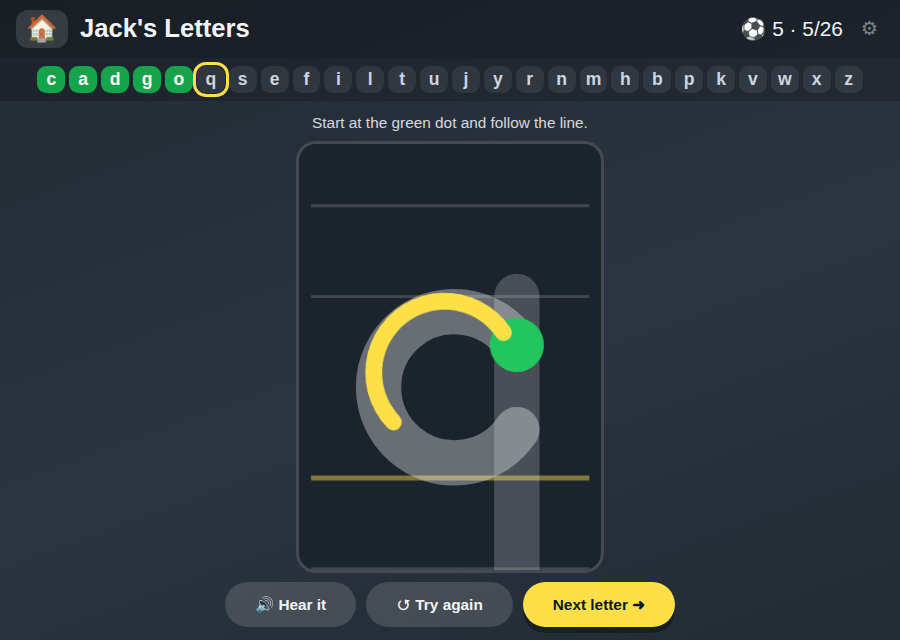

# ✏️ Jack's Letters

**Finger-trace all 26 lowercase letters in the correct stroke order**

[](https://jacks-games.github.io/letters/)




## What this is

A handwriting game. Colouring a letter in is not writing it, so this checks **formation**: the
right starting point, the right direction, the right stroke order — the things a child is
actually marked on when learning to write.

Each of the 26 lowercase letters is drawn as one to three strokes over school writing guides
(ascender line, x-height, baseline, descender). A green dot and an arrow show where each stroke
starts and which way it goes. The finger has to follow the line; lifting it half way starts that
stroke again.

The letters are taught in **movement families** rather than alphabetically, which is how
handwriting schemes sequence them — everything that starts with the same anticlockwise curve is
learned together, then everything that goes straight down, and so on.

## 🎮 How to play

### 1️⃣ &nbsp; Find the green dot 🟢
Every letter starts in one particular place. The arrow shows the direction.

### 2️⃣ &nbsp; Slide, don't lift 👆
Follow the grey line with one finger. Lift it and that stroke resets.

### 3️⃣ &nbsp; The stroke turns green ✅
On to the next one. Some letters have two or three.

### ⚽ &nbsp; You wrote it!
The whole letter fills in, and it turns green in the alphabet strip at the top.

## 🔤 The four families

| | |
|---|---|
| ⭕ **Curve round first** | c &nbsp; a &nbsp; d &nbsp; g &nbsp; o &nbsp; q &nbsp; s &nbsp; e &nbsp; f |
| ⬇️ **Straight down** | i &nbsp; l &nbsp; t &nbsp; u &nbsp; j &nbsp; y |
| 🌉 **Down, then over the bridge** | r &nbsp; n &nbsp; m &nbsp; h &nbsp; b &nbsp; p &nbsp; k |
| ⚡ **Zig-zag** | v &nbsp; w &nbsp; x &nbsp; z |

Any letter can be tapped in the strip to jump straight to it — useful when a child wants to
write their own initial first.

## 🎯 What it practises

- ✍️ &nbsp; Starting each letter in the correct place
- 🔄 &nbsp; Moving in the correct direction, especially the anticlockwise family
- 📏 &nbsp; Letter height against the baseline and x-height

## ⚙️ How the checking works

Each stroke is an SVG path in a 100 × 140 box. About twenty checkpoints are sampled along it
with `SVGPathElement.getPointAtLength()`, and the finger must reach them **in order**, within a
tolerance radius. Passing several checkpoints in one fast swipe is fine; skipping the middle of
a stroke is not. Ink is drawn on a `<canvas>` above the SVG using pointer events with
`touch-action: none`, so a finger draws instead of scrolling the page.

`TOL` (17 board units, near the top of the script) is the single knob to turn if it feels too
fussy or too forgiving for a particular child.

## 🎈 The other games

| Game | What it is | |
|---|---|---|
| 📖 [**Jack's Words**](https://github.com/jacks-games/words) | Hear a word, build it from letter tiles, then read it in a sentence | [▶ play](https://jacks-games.github.io/words/) |
| 🥅 [**Jack's Match**](https://github.com/jacks-games/match) | Tell real words from decodable nonsense words, then spell by ear | [▶ play](https://jacks-games.github.io/match/) |
| ✏️ [**Jack's Letters**](https://github.com/jacks-games/letters) | Finger-trace all 26 lowercase letters in the correct stroke order | [▶ play](https://jacks-games.github.io/letters/)  👈 **this one** |
| 🔢 [**Jack's Numbers**](https://github.com/jacks-games/numbers) | Count, add and subtract with footballs — to 10, then to 20 | [▶ play](https://jacks-games.github.io/numbers/) |
| 🍎 [**Jack's Apples**](https://github.com/jacks-games/apples) | Trace 1–20, then fill the missing numbers into the apple grid | [▶ play](https://jacks-games.github.io/apples/) |
| 👀 [**Jack's Sight Words**](https://github.com/jacks-games/sight-words) | The twenty most common English words on big cards — tap one and hear it read out | [▶ play](https://jacks-games.github.io/sight-words/) |
| ♟️ [**Jackies Schach**](https://github.com/jacks-games/chess) | Full FIDE rules with a coach that marks the safe squares (German) | [▶ play](https://jacks-games.github.io/chess/) |

All seven on one start page: **[jackbenn.ing](https://jackbenn.ing)**

## 🛠 Built like this

Every game in this organisation is **one self-contained `index.html`** — no build step, no
framework, no package manager, no analytics, and no network calls once the page has loaded.
That is a deliberate constraint: a game a child depends on should still work in five years,
and a parent should be able to read the whole thing in one sitting.

- **Speech** — the browser's Web Speech API, preferring a British English voice. It always
  waits for a tap first, because Chrome and iOS block audio without user activation.
- **Progress** — kept in `localStorage` on the device. Nothing is collected, sent or stored
  anywhere else.
- **Made for** an iPad mini in either orientation: finger-sized targets, no hover-only
  interactions, `prefers-reduced-motion` respected.

Run it locally:

```bash
python3 -m http.server 8000
```

The start page at [jackbenn.ing](https://jackbenn.ing) is built from
[google814/Jack](https://github.com/google814/Jack), which is the source of truth. The repos
in this organisation are copies kept in step by `tools/sync-game-repos.sh` in that repo, so
each game also has its own page and its own link.
